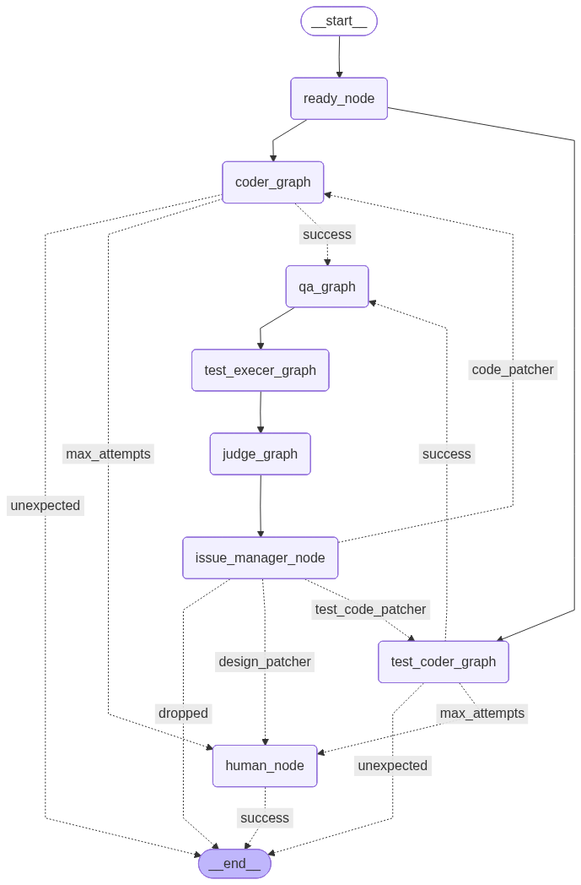

# 一个 Code Team.

基于 LangGraph 的多 Agent 协作开发系统.



---

## Quickstart
### 1. 后端

```shell
uv sync
python user_server.py
```

### 2. thread前端

```shell
cd thread_webui
npm install
npm run dev
```


---

## 任务清单
- [ ] tasks.json生成可能不够完美,比如T002不应该有参考文件列表. T005解析有问题. title应该就是原文, 参考列表是另外的.
- [x] 上下文消息去重：历史消息中工具调用结果重复出现（如多次 `read_file` 返回相同内容），导致token和节点调用次数过多 。
  - 方案 1：工具内检查文件 hash，若无变化则提示 Agent 使用记忆；
  - 方案 2：对历史消息做"除旧"——写入文件后，将之前同类工具的旧结果标记为空。
- [ ] Recursion Limit：要配置合适的limit参数,来控制节点调用次数.当前配置为100,够第一个spec_subgraph运行.
- [ ] 文件权限：llm常常会能力越界,修改查看不必要的文件, 现在`file_ledger`不够。
- [ ] 子图检查点支持：全图将子图视为单个节点，无法展示子图内部的详细执行步骤, 无法从子图内某个检查点进行time-travel.
- [ ] 尽量使用英文prompt, message. 节省token
- [x] Prompt Playground：提示词工程.引入可视化测试环境，复现和优化. 也可以用于llm单独的测试.
- [x] LLM 过度更新文件：通过 prompt 约束为"仅在必要时更新文件"。
- [x] 引入 SpecKit 规范驱动开发流程，生成 `constitution → spec → plan → tasks`。

---

## Issue
- [ ] 上下文消息去重中.文件写入后，之前 `read_file` 产生的 ToolMessage 内容被置空。DeepSeek 缓存机制下，内容变更会导致额外一次重新缓存。

---

## License

MIT